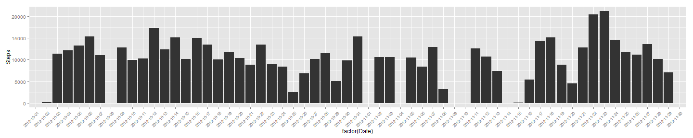
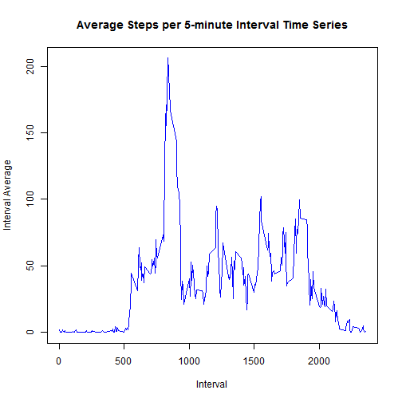
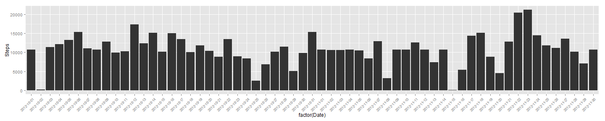

Reproducible Research: Peer Assessment 1
========================================

## Loading and preprocessing the data

```r
library(ggplot2)
library(plyr)
library(lattice)

data <- read.csv("activity.csv")
dailytotals <- aggregate(data$steps, by=list(data$date), FUN=sum)
colnames(dailytotals) <- c("Date","Steps")
dailytotals$Date <- as.Date(dailytotals$Date)
```

## What is mean total number of steps taken per day?

First, we'll look at a histogram of the total number of steps per day through the two-month period covered by the data set.


```r
par(las=2)
ggplot(dailytotals, aes( x = factor(Date), y = Steps)) + geom_histogram(stat= "identity") + theme(axis.text.x = element_text(size=8, angle=45, hjust=1))
```

```
## Warning: Removed 8 rows containing missing values (position_stack).
```

 


For this two-month period, the mean number of steps is 10766 and the median number of steps is 10765.


## What is the average daily activity pattern?

```r
goodrows <- complete.cases(data)
data1 <- data[goodrows,]
avgint <- aggregate(data1$steps, by=list(data1$interval), FUN=mean)
colnames(avgint) = c("Interval", "Average")
plot(avgint$Interval, avgint$Average, type="l", col="blue", main="Average Steps per 5-minute Interval Time Series", xlab="Interval", ylab="Interval Average")
```

 

```r
indexMax = which(avgint$Average == max(avgint$Average))
intervalMax = avgint[indexMax, "Interval"]
```

The 835 time interval is when the maximum average steps occurs in a day across the two-month data set.
## Imputing missing values

There are 2304 missing values in the data set.


Here is a summary of a new data set where the missing steps values have been replaced with the average of the steps for the respective 5-minute time interval.


```r
summary(datareplace)
```

```
##      steps               date          interval   
##  Min.   :  0.0   2012-10-01:  288   Min.   :   0  
##  1st Qu.:  0.0   2012-10-02:  288   1st Qu.: 589  
##  Median :  0.0   2012-10-03:  288   Median :1178  
##  Mean   : 37.4   2012-10-04:  288   Mean   :1178  
##  3rd Qu.: 27.0   2012-10-05:  288   3rd Qu.:1766  
##  Max.   :806.0   2012-10-06:  288   Max.   :2355  
##                  (Other)   :15840
```

Histogram of the total number of steps taken each day.


```r
dailytotals2 <- aggregate(datareplace$steps, by=list(datareplace$date), FUN=sum)
colnames(dailytotals2) <- c("Date","Steps")
dailytotals2$Date <- as.Date(dailytotals2$Date)
```


```r
par(las=2)
ggplot(dailytotals2, aes( x = factor(Date), y = Steps)) + geom_histogram(stat= "identity") + theme(axis.text.x = element_text(size=8, angle=45, hjust=1))
```

 


```r
meanDaily2 <- mean(dailytotals2$Steps)
medianDaily2 <- median(dailytotals2$Steps)
```

For this two-month period, using the data set where missing values have been replaced by their respective interval averages, the mean number of steps is 10766 and the median number of steps is 10766. The mean and median values have been rounded to an integer, and as these values show, the difference in mean and median between the original and the replacement data sets is very small. The median value increased by 1 or only by 0.0093 percent. 

## Are there differences in activity patterns between weekdays and weekends?


```r
datareplace$partOfWeek <- ifelse(weekdays(as.Date(datareplace$date), abbreviate=TRUE) %in% c("Sat", "Sun"), "weekend", "weekday")

avgint2 <- aggregate(datareplace$steps, by=list(datareplace$interval, datareplace$partOfWeek), FUN=mean)
colnames(avgint2) = c("Interval", "PartOfWeek", "Average")

xyplot(Average ~ Interval | PartOfWeek, data=avgint2, layout=c(1,2), xlab="Interval", ylab="Number of steps", type="l")
```

 
